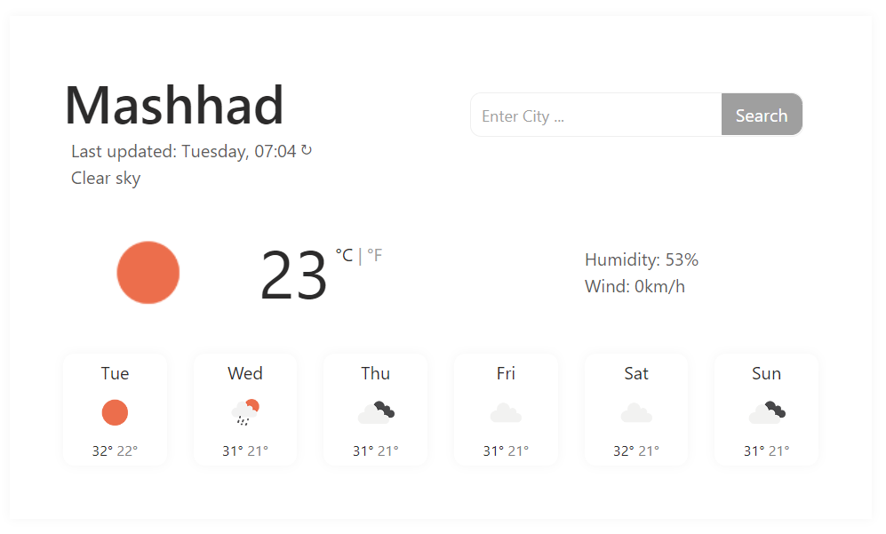

<h1> Vanilla Weather App </h1>

 It utilizes the open weather API to get the weather information 

<h3> Features</h3>
<ul>
  <li> Gets the visitor location via browser navigator API, so loads the correct location initially</li>
  <li> Refresh button to update the weather</li>
  <li> Search input to search for any other city </li>
  <li> Celsius / Fahrenheit conversion</i>
</ul>

<h2> Live Version </h2>

 This game is live on <a href="https://zippy-kitten-fd98bf.netlify.app" target="_blank"> here </a> 

<h2> App Screenshot </h2>

     

